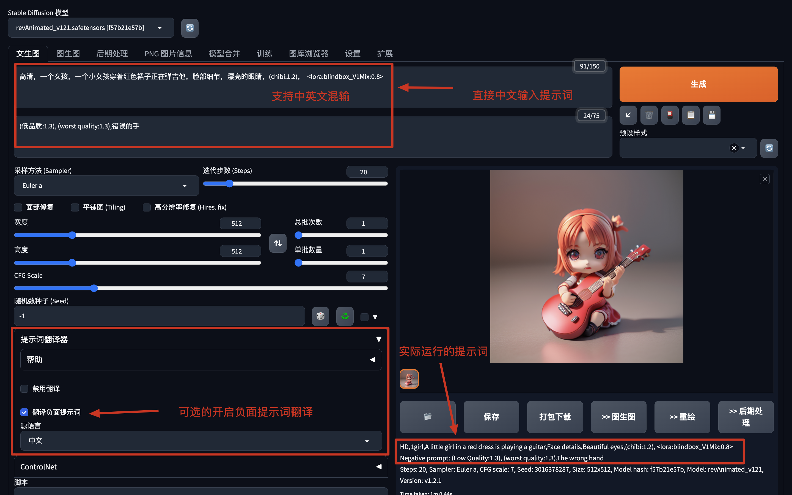

# 直接用中文写提示词的Stable Diffusion扩展：sd-prompt-translator
本插件具有以下特点：
1. 直接使用中文编写提示词，即使完全不会英文都不受影响。
2. 完美兼容SD的提示词语法，支持中英文混输。
3. 基于facebook/mbart-large-50-many-to-many-mmt的prompt翻译模型（在首次安装使用时会自动下载约2.4G的翻译模型, 请确保网络连接正常），在本地自然语言处理模型进行翻译，使用时无需连接百度翻译、Google翻译等服务，可离线使用。
4. 支持自定义翻译字词。在stable-diffusion-webui/extensions/sd-prompt-translator/scripts/translations.csv中保存了大量常用的中文触发词对应的英文Prompt，你可以手动修改该文件内容，增加自己的自定义翻译内容。
5. 默认翻译中文，可选择翻译其他50多种语言。
6. API支持，对开发AIGC应用更友好。
## 启用本扩展后的效果

